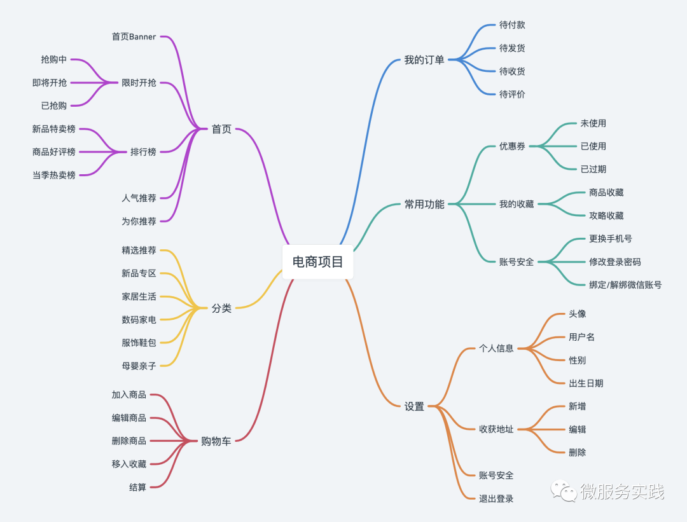

## lebron
Highly concurrent mall system built on go-zero

## Architecture 
A busy sum, when there is time to make up for it

## Series of Courses
[go-zero 微服务实战系列（一、开篇）](https://mp.weixin.qq.com/s?__biz=Mzg2ODU1MTI0OA==&mid=2247485597&idx=1&sn=7e85894b7847cc50df51d66092792453&scene=21#wechat_redirect)

[go-zero 微服务实战系列（二、服务拆分）](https://mp.weixin.qq.com/s?__biz=Mzg2ODU1MTI0OA==&mid=2247485645&idx=1&sn=d329f56741dbe1f3e09713a6e4d1f7f0&scene=21#wechat_redirect)

[go-zero微服务实战系列（三、API定义和表结构设计）](https://mp.weixin.qq.com/s/ZWfzuJuJKeyJM3PMJ-SysQ)

[go-zero微服务实战系列（四、CRUD热身）](https://mp.weixin.qq.com/s/AIcJkMKTL0odqy1NzeJkxg)

[go-zero微服务实战系列（五、缓存代码怎么写）](https://mp.weixin.qq.com/s/QqrLOq7DcDVuIM_1YAaVTw)

[go-zero微服务实战系列（六、缓存一致性保证）](https://mp.weixin.qq.com/s/422ZHs81y7nN9Sgb_ESsgg)

[go-zero微服务实战系列（七、请求量这么高该如何优化）](https://mp.weixin.qq.com/s/pPPSPZJispmITY9Wsi7hUg)

[go-zero微服务实战系列（八、如何处理每秒上万次的下单请求）](https://mp.weixin.qq.com/s/OAbuzj876SrrcB5WO_2FuA)

[go-zero微服务实战系列（九、极致优化秒杀性能）](https://mp.weixin.qq.com/s/8VSS9WNSy4jkOSSIA4BmLw)

## Basic Environment
| Name    | Description              | Link                    |
| ------- | ------------------------ | ----------------------- |
| Go-Zero | Web & Rpc Go Frame       | https://go-zero.dev/cn/ |
| Mysql   | DB                       | https://www.mysql.com/  |
| Redis   | Cache                    | https://redis.io/       |
| Docker  | Code Runtime Environment | https://www.docker.com/ |
| MQ      |                          |                         |

## Code Components

| Name   | Description                               | Link                     |
| ------ | ----------------------------------------- | ------------------------ |
| sqlx   | db table crud                             |                          |
| copier | copy value from struct to struct and more | github.com/jinzhu/copier |

## Business Function

## Server Port 

### API

| server name    | port  |
| -------------- | ------|
| api bff        | 8001  |

### RPC
| server name    | port  |
| -------------- | ------|
| user rpc       | 9001  |
| product rpc    | 9002  |
| order rpc      | 9003  |
